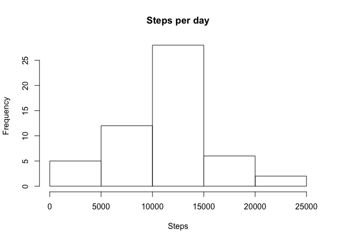
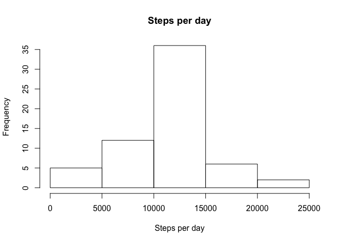
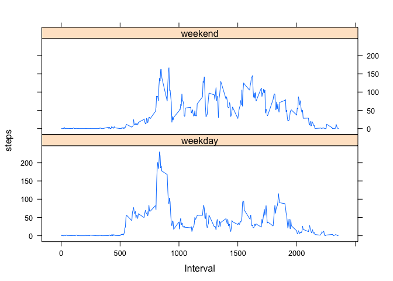

# Reproducible Research: Peer Assessment 1


## Loading and preprocessing the data
First we unzip the file, then load the resultant csv data into a dataframe named 
data

```r
  dataLoc <- "activity.zip"
  dataLocUnZip <- unzip(dataLoc)
  data <- read.csv(dataLocUnZip)
```

## What is mean total number of steps taken per day?
To find the total number of steps taken per day we first need to clean the data
by removing all thet NA values: 

```r
  cleanData <- na.omit(data)
```
To find the mean and median steps per day, we use the plyr package and the 
ddplyr command to create a dataframe which contains the number of steps for each
day. We then use the mean and median command. 


```r
  library(plyr)
  stepsPerDay <- ddply(cleanData, .(date), summarize,  steps=sum(steps))

  hist(stepsPerDay$steps, main = "Steps per day", xlab = "Steps")
```

 

```r
  meanSteps <- mean(stepsPerDay$steps)
  medianSteps <- median(stepsPerDay$steps)
```
From the histogram, we can see that mostly 10,000 - 15,000 steps are performed
per day. It is more common to do less than 10000 steps than to do more than 15000
steps. 

The mean number of steps is 1.0766189\times 10^{4} and the median is 10765.  

## What is the average daily activity pattern?
We are now interested in what the average steps in each each interval. We use 
ddaplyr to create a new dataframe which has the mean number of steps for each 
interval. We then plot the average number of steps per interval. 


```r
  averageInterval <- ddply(cleanData, .(interval), summarize,  steps=mean(steps))

  plot(averageInterval$interval, averageInterval$steps, type = "l", 
       main = "Steps per interval", xlab = "Interval", ylab = "Steps")
```

 

```r
  maxSteps <- averageInterval[which.max(averageInterval$steps), 1 ]
```

Not many steps occur early on in the day, probably due to people sleeping. There 
is a peak in the early morning, but that slowly levels out to around 50-100 steps
per interval. Towards the end of the day it goes towards 0. 

We also find that the interval 835 contains the most amount of steps

## Imputing missing values
Now we are replacing the NA values with the average value for that interval. This 
isn't necessarily the best choice as the average could have been calculated from
very little data and not be an accurate reflection of how many steps occured in
that interval. However, due to lack of other data, and because we already have
calcualted the average steps per interval, we will be using this.

To do this, we are merging the data and averageInterval dataframes together. 
This means for each row, we have the relevant average steps for that interval. 
The steps.x column is the original data and the step.y column is the average. We
then replace all the NA values in steps.x with the value found in steps.y (i.e.
replace the original NA with the average steps).

Lastly, we remove the steps.y column and rename the steps.x column to steps.


```r
  dataAdded <- merge(data, averageInterval, by = "interval")
  dataAdded$steps.x[is.na(dataAdded$steps.x)] <- 
                        as.integer(dataAdded$steps.y[is.na(dataAdded$steps.x)])
```
Now we are going to create an histogram showing the steps per day and calculate
the mean and median number of steps per day.


```r
  stepsPerDayAdded <- ddply(dataAdded, .(date), summarize,  steps=sum(steps.x))
  hist(stepsPerDayAdded$steps, main = "Steps per day", xlab = "Steps per day")
```

 

```r
  meanStepsDayAdded <- mean(stepsPerDayAdded$steps)
  medianStepsDayAdded <- median(stepsPerDayAdded$steps)
```

The mean number of steps per day is 1.074977\times 10^{4} (before 1.0766189\times 10^{4}) 
and the median is 10641 (before 10765). Using the 
inputted data has slightly decreased the mean and median. 


## Are there differences in activity patterns between weekdays and weekends?
We now want to find out if number of steps is different on weekdays compared to
weekends. To do this we first create a new dataframe with a column denoting if
the date is on a weekend. We then use ddply do create a summary of the number
of steps

```r
  stepsWeekend <- mutate(dataAdded, weekend = ifelse( weekdays(as.Date(date)) 
                          %in% c("Saturday", "Sunday"), "weekend", "weekday"))

  averageInterval <- ddply(stepsWeekend, .(interval, weekend), summarize,  
                           steps=mean(steps.x))
```

We now plot the graphs using lattice


```r
  library(lattice) 

  xyplot(steps~interval|weekend, averageInterval,
   xlab="Interval", layout=c(1,2), type = "l", horizontal = FALSE, 
   tick.number = 500)
```

 

From these plots we can see that on weekends there is a more consistent number of
steps during the day. On the weekends and weekdays there is a peak in the number 
of steps in the morning, although on the weekends this peak is less pronounced.
